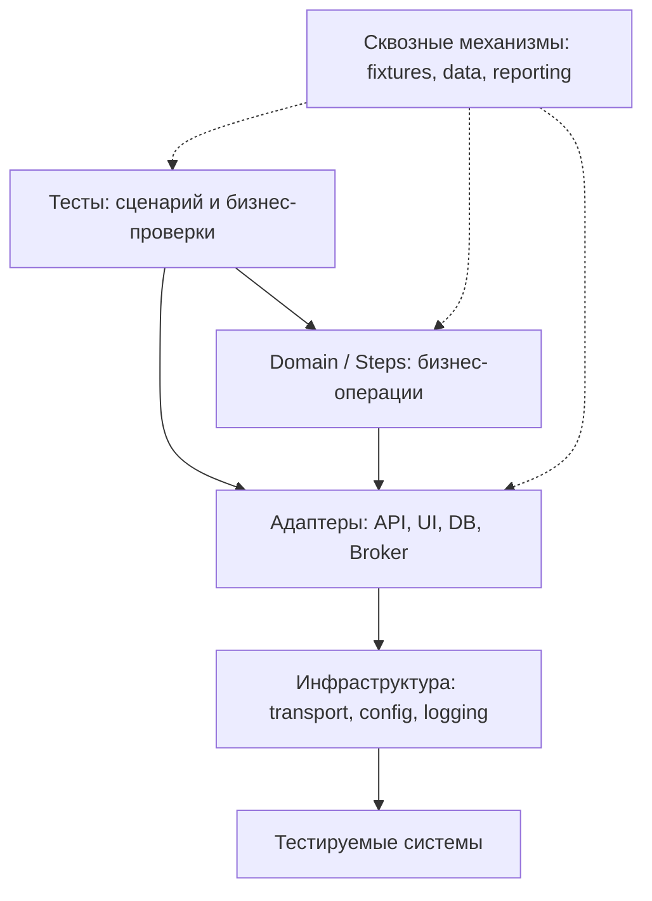

# Архитектура тестового фреймворка — полный конспект

[← Все полные материалы](README.md) · [Короткая шпаргалка](../cheatsheets/test-framework-architecture.md) · [Раздел архитектуры](../questions/architecture.md)

Материал про устройство автотестового фреймворка для AQA/SDET на Python. Здесь нет Django и лишней backend-теории: основной вопрос — как разделить тесты, инфраструктуру и бизнес-логику так, чтобы проект было удобно развивать, запускать параллельно и диагностировать в CI.

> **Как пользоваться конспектом**
>
> Сначала разберись со слоями и направлением зависимостей. Затем изучи отдельные блоки: клиенты, фикстуры, данные, проверки, конфигурацию и отчётность. Перед собеседованием повтори готовые ответы и чек-лист проектирования.

## Навигация

- [Основы архитектуры](#основы-архитектуры)
- [Слои и зависимости](#слои-и-зависимости)
- [Структура Python-проекта](#структура-python-проекта)
- [Данные, конфигурация и проверки](#данные-конфигурация-и-проверки)
- [Паттерны проектирования](#паттерны-проектирования)
- [Стабильность, параллельность и CI](#стабильность-параллельность-и-ci)
- [Антипаттерны](#антипаттерны)
- [Проектирование на собеседовании](#проектирование-на-собеседовании)

## Основы архитектуры

### 1. Что такое архитектура тестового фреймворка

Архитектура тестового фреймворка — это правила, по которым организованы тесты, вспомогательный код и зависимости между ними.

Она отвечает на вопросы:

- где находятся тестовые сценарии;
- кто работает с API, UI, БД и брокером;
- кто создаёт и удаляет тестовые данные;
- где хранится конфигурация;
- как оформляются проверки, логи и отчёты;
- как тесты запускаются локально, параллельно и в CI;
- как добавить новый сервис или тип тестов, не переписывая весь проект.

> **Короткий ответ для собеседования**
>
> Архитектура тестового фреймворка определяет ответственность модулей и направление зависимостей между ними. Хорошая архитектура оставляет в тесте только сценарий и бизнес-проверки, а работу с API, UI, БД, данными, конфигурацией и отчётностью выносит в отдельные слои.

### 2. Чем фреймворк отличается от набора тестов

**Набор тестов** может состоять из нескольких файлов, в которых напрямую вызываются `requests`, Selenium или SQL.

**Фреймворк** дополнительно предоставляет повторно используемые механизмы:

- конфигурацию окружений;
- клиентов и адаптеры;
- управление жизненным циклом ресурсов;
- фабрики тестовых данных;
- общие проверки;
- логирование и отчётность;
- правила структуры проекта;
- точки расширения;
- интеграцию с CI.

Фреймворк не обязательно должен быть отдельной библиотекой. Это может быть хорошо организованный репозиторий автотестов с понятными правилами.

### 3. Какие задачи должна решать архитектура

Хорошая архитектура помогает получить следующие свойства:

| Свойство | Что это означает |
|---|---|
| Читаемость | По тесту понятен пользовательский или бизнес-сценарий |
| Переиспользование | HTTP-вызовы, локаторы и подготовка данных не копируются |
| Изоляция | Тесты не зависят от порядка запуска и данных соседей |
| Расширяемость | Новый сервис или браузер добавляется без массовой переделки |
| Диагностируемость | При падении видны запросы, ответы, шаги, логи и окружение |
| Тестируемость | Вспомогательный код можно проверять отдельно |
| Управляемость | Понятно, где менять timeout, URL, авторизацию или схему данных |
| Параллельность | Несколько workers не конфликтуют из-за общих ресурсов |

### 4. Архитектура зависит от контекста

Не существует одной структуры, подходящей любому проекту.

На выбор влияют:

- тестируем ли мы API, UI, мобильное приложение, БД или события;
- сколько сервисов и команд участвует;
- какие тесты запускаются в CI;
- нужны ли параллельность и несколько окружений;
- насколько сложны тестовые данные;
- есть ли внешние зависимости;
- какой объём проекта ожидается через год.

Для небольшого API не нужны десятки абстракций. Для платформы из множества сервисов один `conftest.py` и один универсальный `BaseClient` быстро станут проблемой.

> **Короткий ответ для собеседования**
>
> Я не начинаю с максимального количества слоёв. Сначала определяю типы тестов, внешние системы, жизненный цикл данных и требования CI. Архитектура должна быть достаточно простой для текущей задачи и иметь понятные точки расширения.

## Слои и зависимости

### 5. Базовая слоистая схема

Один из практичных вариантов для AQA/SDET:



Это не обязательная догма. В небольшом проекте слой `Domain / Steps` можно не вводить, пока он не начал убирать реальное дублирование.

### 6. Главный принцип зависимостей

Высокоуровневый тест не должен знать низкоуровневые детали транспорта.

Например, тесту важно выразить:

```python
order = orders.create_for(user=user, amount=1500)
orders.wait_until_paid(order.id)
assert_order_paid(order)
```

Тесту не обязательно знать:

- точный URL каждого запроса;
- формат заголовка авторизации;
- способ подключения к БД;
- название Kafka topic;
- алгоритм polling;
- формат логирования HTTP.

Нижние слои не должны импортировать тесты. Иначе появляются циклические зависимости и инфраструктура начинает знать о конкретных сценариях.

### 7. Слой тестов

В тесте обычно остаются:

1. исходное состояние и данные;
2. действие;
3. ожидаемый бизнес-результат;
4. при необходимости — важные технические проверки.

```python
def test_user_can_cancel_new_order(
    order_steps: OrderSteps,
    new_order: Order,
) -> None:
    cancelled_order = order_steps.cancel(new_order.id)

    assert cancelled_order.status == "CANCELLED"
    assert order_steps.get(new_order.id).status == "CANCELLED"
```

В тесте не стоит размещать длинную настройку HTTP-сессии, ручной SQL cleanup или десятки строк поиска элементов.

### 8. Domain, Steps или Service layer

Этот слой описывает повторно используемые бизнес-операции:

- создать оплаченный заказ;
- зарегистрировать пользователя;
- дождаться обработки события;
- выдать роль;
- подготовить корзину;
- отменить подписку.

```python
class OrderSteps:
    def __init__(self, orders: OrderClient, payments: PaymentClient) -> None:
        self.orders = orders
        self.payments = payments

    def create_paid_order(self, user_id: int, amount: int) -> Order:
        order = self.orders.create(user_id=user_id, amount=amount)
        self.payments.pay(order_id=order.id, amount=amount)
        return self.orders.wait_for_status(order.id, expected="PAID")
```

Такой слой полезен, если операция повторяется во многих тестах. Не нужно превращать каждый одиночный вызов клиента в отдельный step-метод без дополнительного смысла.

### 9. Слой клиентов и адаптеров

Адаптер скрывает детали конкретной технологии:

- `UserApiClient` — HTTP;
- `UsersPage` — UI;
- `UserRepository` — БД;
- `OrdersConsumer` — брокер сообщений;
- `StorageClient` — S3/MinIO;
- `FakePaymentGateway` — тестовый double.

Клиент отвечает за техническое взаимодействие, но не должен содержать утверждения конкретного теста.

```python
class UserClient:
    def __init__(self, session: requests.Session, base_url: str) -> None:
        self.session = session
        self.base_url = base_url.rstrip("/")

    def get(self, user_id: int) -> requests.Response:
        return self.session.get(
            f"{self.base_url}/users/{user_id}",
            timeout=5,
        )
```

### 10. Инфраструктурный слой

Инфраструктура содержит общие технические механизмы:

- создание HTTP-сессии;
- retry transport-level ошибок;
- загрузку настроек;
- управление соединениями;
- сериализацию;
- logging;
- Allure attachments;
- базовый polling;
- интеграции с внешними инструментами.

Инфраструктурный код не должен знать, что конкретный тест проверяет отмену заказа или права администратора.

### 11. Сквозные механизмы

Некоторые механизмы используются несколькими слоями:

- fixtures;
- configuration;
- test data;
- assertions;
- logging и reporting;
- tracing;
- cleanup.

Их важно не превращать в глобальное состояние. Передаваемые зависимости и явные объекты обычно легче контролировать, чем случайные singleton и глобальные переменные.

## Структура Python-проекта

### 12. Пример структуры

```text
project/
├── pyproject.toml
├── tests/
│   ├── conftest.py
│   ├── api/
│   │   ├── test_users.py
│   │   └── test_orders.py
│   ├── ui/
│   │   └── test_checkout.py
│   └── integration/
│       └── test_order_events.py
├── framework/
│   ├── config/
│   │   ├── settings.py
│   │   └── environments.py
│   ├── clients/
│   │   ├── users.py
│   │   └── orders.py
│   ├── pages/
│   │   ├── login_page.py
│   │   └── checkout_page.py
│   ├── db/
│   │   └── repositories.py
│   ├── broker/
│   │   ├── producer.py
│   │   └── consumer.py
│   ├── models/
│   │   ├── users.py
│   │   └── orders.py
│   ├── data/
│   │   ├── factories.py
│   │   └── builders.py
│   ├── steps/
│   │   └── order_steps.py
│   ├── assertions/
│   │   └── orders.py
│   ├── reporting/
│   │   └── attachments.py
│   └── utils/
│       └── polling.py
└── unit_tests/
    └── test_framework_helpers.py
```

Это пример, а не обязательный стандарт. Папки стоит вводить, когда у них появляется отдельная ответственность и реальное содержимое.

### 13. Как делить `conftest.py`

Корневой `conftest.py` содержит только действительно общие фикстуры и регистрацию плагинов.

Фикстуры конкретного типа тестов можно держать ближе к этим тестам:

```text
tests/
├── conftest.py
├── api/
│   ├── conftest.py
│   └── test_users.py
└── ui/
    ├── conftest.py
    └── test_login.py
```

Для большого набора фикстур удобно использовать pytest-плагины:

```python
# tests/conftest.py
pytest_plugins = [
    "framework.fixtures.api",
    "framework.fixtures.database",
    "framework.fixtures.users",
]
```

Антипаттерн — огромный `conftest.py`, в котором смешаны браузер, БД, API, пользователи, cleanup и бизнес-сценарии.

### 14. Что должна делать fixture

Fixture управляет зависимостью или ресурсом:

- создаёт клиент;
- поднимает браузер;
- создаёт пользователя;
- открывает соединение;
- начинает транзакцию;
- освобождает ресурс после теста.

```python
@pytest.fixture
def created_user(user_client: UserClient) -> Iterator[User]:
    user = user_client.create(build_user())
    yield user
    user_client.delete(user.id)
```

Fixture не должна скрывать половину тестового сценария. Если важное бизнес-действие произошло неявно, тест сложно читать и диагностировать.

### 15. Scope фикстур и жизненный цикл

Scope выбирают по времени жизни и безопасности ресурса:

| Scope | Подходит для | Основной риск |
|---|---|---|
| `function` | изменяемые данные теста | более дорогая подготовка |
| `class` | общий ресурс тестового класса | зависимость тестов от общего состояния |
| `module` | ресурс группы тестов | сложнее изолировать изменения |
| `session` | конфигурация, read-only клиент, дорогой стабильный сервис | утечка изменяемого состояния между тестами |

Объект с session scope не обязан быть безопасным для параллельного доступа. Scope и thread/process safety — разные вопросы.

### 16. Клиенты: один универсальный или несколько предметных

Полезно разделять:

- общий транспорт — отправляет запрос, применяет timeout и логирование;
- предметный клиент — знает endpoint и модели конкретного ресурса.

```python
class HttpTransport:
    def __init__(self, session: requests.Session, base_url: str) -> None:
        self.session = session
        self.base_url = base_url.rstrip("/")

    def request(self, method: str, path: str, **kwargs) -> requests.Response:
        return self.session.request(
            method=method,
            url=f"{self.base_url}{path}",
            timeout=kwargs.pop("timeout", 5),
            **kwargs,
        )


class OrdersClient:
    def __init__(self, transport: HttpTransport) -> None:
        self.transport = transport

    def get(self, order_id: int) -> requests.Response:
        return self.transport.request("GET", f"/orders/{order_id}")
```

Один огромный `BaseClient`, который знает все endpoints, бизнес-правила и проверки, со временем превращается в god object.

### 17. Нужно ли проверять response внутри клиента

Есть два допустимых подхода:

1. клиент возвращает сырой response, а тест проверяет status и body;
2. клиент валидирует базовый контракт и возвращает модель, а для негативных сценариев предоставляет raw-метод.

Важно не потерять возможность тестировать ошибочные ответы.

```python
class OrdersClient:
    def create_raw(self, payload: dict) -> requests.Response:
        return self.transport.request("POST", "/orders", json=payload)

    def create(self, payload: dict) -> Order:
        response = self.create_raw(payload)
        response.raise_for_status()
        return Order.model_validate(response.json())
```

Если каждый client-метод всегда вызывает `raise_for_status()`, негативные тесты на `400`, `403` или `409` становятся неудобными.

### 18. Page Object и Component Object

Page Object скрывает локаторы и технические действия со страницей.

```python
class LoginPage:
    def __init__(self, page: Page) -> None:
        self.page = page

    def open(self) -> None:
        self.page.goto("/login")

    def login(self, username: str, password: str) -> None:
        self.page.get_by_label("Логин").fill(username)
        self.page.get_by_label("Пароль").fill(password)
        self.page.get_by_role("button", name="Войти").click()
```

Повторяющиеся части интерфейса — header, modal, table, menu — удобно оформлять как Component Object.

Page Object не должен содержать тест `test_login` или десятки утверждений конкретного сценария. Он предоставляет состояние и действия, а решение о том, что проверять, остаётся выше.

### 19. Работа с БД

SQL лучше изолировать в repository или query layer:

```python
class OrdersRepository:
    def __init__(self, connection: Connection) -> None:
        self.connection = connection

    def get_status(self, order_id: int) -> str | None:
        row = self.connection.execute(
            text("SELECT status FROM orders WHERE id = :order_id"),
            {"order_id": order_id},
        ).one_or_none()
        return None if row is None else row.status
```

Преимущества:

- SQL не дублируется в тестах;
- проще менять драйвер и схему;
- в одном месте контролируются транзакции;
- запросы можно отдельно проверить.

Но repository не должен скрывать важную бизнес-проверку за названием вроде `validate_everything()`.

### 20. Работа с брокером сообщений

Отдельные адаптеры могут отвечать за:

- публикацию сообщения;
- чтение из topic или queue;
- correlation ID;
- десериализацию;
- ожидание нужного события;
- управление offset/ack;
- очистку тестового consumer group.

```python
event = events.wait_for(
    event_type="order_paid",
    predicate=lambda item: item.order_id == order.id,
    timeout=15,
)

assert event.amount == order.amount
```

Для асинхронной системы лучше ожидать конкретное условие с deadline, а не использовать фиксированный `sleep`.

## Данные, конфигурация и проверки

### 21. Конфигурация окружений

Конфигурация должна загружаться один раз, валидироваться и передаваться зависимостям явно.

```python
from pydantic_settings import BaseSettings, SettingsConfigDict


class Settings(BaseSettings):
    base_url: str
    db_url: str
    request_timeout: float = 5.0

    model_config = SettingsConfigDict(
        env_prefix="TEST_",
        env_file=".env",
        extra="ignore",
    )
```

Приоритет настроек может быть таким:

1. CLI-параметры CI;
2. переменные окружения;
3. локальный `.env`;
4. безопасные значения по умолчанию.

Секреты нельзя хранить в репозитории или печатать в отчёте. Токены, пароли и cookies нужно маскировать.

### 22. Тестовые данные: factory и builder

Factory создаёт валидный объект с разумными значениями по умолчанию:

```python
def build_user(**overrides: object) -> dict[str, object]:
    payload: dict[str, object] = {
        "email": f"user-{uuid4().hex}@example.test",
        "name": "Autotest User",
        "age": 30,
    }
    payload.update(overrides)
    return payload
```

Builder удобен, когда объект собирается пошагово или имеет много вариантов.

Основные требования к данным:

- уникальность при параллельном запуске;
- понятные defaults;
- возможность точечно переопределить поле;
- отсутствие зависимости от текущего времени без контроля;
- cleanup или TTL;
- воспроизводимость случайных данных через seed, если это нужно.

### 23. Модели и схемы

Модели помогают:

- валидировать структуру ответа;
- получать типизированные объекты;
- централизовать aliases и преобразования;
- отличать транспортный контракт от произвольного словаря.

```python
class Order(BaseModel):
    id: int
    status: Literal["NEW", "PAID", "CANCELLED"]
    amount: Decimal
```

Не стоит одной моделью описывать всё сразу: payload запроса, response, строку БД и событие брокера. Эти контракты могут изменяться независимо.

### 24. Assertions и matchers

Простую проверку лучше оставить прямо в тесте:

```python
assert response.status_code == 201
assert body["status"] == "NEW"
```

Helper полезен, если проверка:

- повторяется;
- состоит из нескольких связанных условий;
- должна выдавать качественную диагностику;
- является общим контрактом.

```python
def assert_order_matches(actual: Order, expected: OrderData) -> None:
    assert actual.status == expected.status
    assert actual.amount == expected.amount
    assert actual.user_id == expected.user_id
```

Плохой helper — `assert_response_is_correct(response)`: из названия непонятно, что именно проверяется.

### 25. Логи, отчёты и артефакты

При падении теста полезно сохранять:

- название теста и окружение;
- request method и URL;
- status code и безопасное тело ответа;
- correlation ID / trace ID;
- SQL или название операции без секретов;
- screenshot, page source, browser console и trace для UI;
- событие брокера и его headers;
- время ожидания и последнее полученное состояние.

Логирование должно находиться на уровне транспорта или адаптера, чтобы каждый тест не реализовывал его самостоятельно.

### 26. Ошибки фреймворка

Полезно разделять:

- дефект продукта;
- ошибку тестовых данных;
- недоступность окружения;
- timeout ожидания;
- ошибку самого фреймворка.

```python
class TestFrameworkError(Exception):
    """Базовая ошибка инфраструктуры тестов."""


class EnvironmentUnavailableError(TestFrameworkError):
    pass


class ConditionTimeoutError(TestFrameworkError):
    pass
```

Не нужно перехватывать все исключения и возвращать `False`: так теряются traceback и причина падения.

## Паттерны проектирования

### 27. Composition over inheritance

В тестовых фреймворках композиция обычно гибче наследования.

```python
class CheckoutSteps:
    def __init__(
        self,
        cart: CartClient,
        orders: OrdersClient,
        payments: PaymentsClient,
    ) -> None:
        self.cart = cart
        self.orders = orders
        self.payments = payments
```

Так зависимости видны и их можно заменить fake-реализацией.

Глубокая иерархия вроде `BaseTest → BaseApiTest → BaseAuthorizedTest → UserTest` часто приводит к скрытому состоянию и неявному setup.

### 28. Dependency Injection

Dependency Injection означает, что объект получает зависимости снаружи, а не создаёт их внутри себя.

```python
class UserSteps:
    def __init__(self, users: UserClient) -> None:
        self.users = users
```

В pytest роль простого DI-контейнера часто выполняют фикстуры:

```python
@pytest.fixture
def user_steps(user_client: UserClient) -> UserSteps:
    return UserSteps(users=user_client)
```

Преимущества:

- зависимости видны;
- легче подменять реализации;
- проще управлять жизненным циклом;
- меньше глобального состояния.

### 29. Factory и Builder

**Factory** создаёт готовый объект или данные.

**Builder** позволяет собрать сложный объект последовательностью методов.

```python
payload = (
    OrderBuilder()
    .for_user(user.id)
    .with_item(product_id=10, quantity=2)
    .with_delivery("courier")
    .build()
)
```

Не стоит создавать builder для объекта из двух полей: паттерн должен уменьшать сложность, а не добавлять церемонию.

### 30. Adapter

Adapter приводит разные внешние системы к удобному интерфейсу.

Например, тестам нужен единый интерфейс отправки уведомления, но на разных стендах используется реальный сервис или fake:

```python
class NotificationGateway(Protocol):
    def find_message(self, recipient: str) -> Message | None:
        ...
```

Реализация может читать email, Kafka или тестовый stub, не меняя тестовый сценарий.

### 31. Facade

Facade объединяет несколько низкоуровневых операций в одну понятную бизнес-операцию.

Пример — `CheckoutSteps.create_paid_order()`, который вызывает корзину, заказы и оплату.

Facade полезен для повторяющихся workflows, но не должен превращаться в огромный класс, который знает всё о системе.

### 32. Strategy

Strategy позволяет подставлять разные алгоритмы:

- разные способы авторизации;
- разные способы очистки данных;
- разные браузеры или transports;
- разные источники тестовых данных;
- разные ожидания статуса.

```python
class CleanupStrategy(Protocol):
    def cleanup(self, resource_id: str) -> None:
        ...
```

### 33. Repository

Repository скрывает детали хранения данных и предоставляет предметные операции:

```python
order = orders_repository.find_by_external_id(external_id)
```

Для тестового кода repository особенно полезен при подготовке данных, cleanup и проверке сайд-эффектов. Но основную бизнес-проверку желательно выполнять через публичный контракт системы, если БД не является предметом теста.

## Стабильность, параллельность и CI

### 34. Изоляция тестов

Независимый тест:

- сам создаёт необходимые данные;
- не зависит от порядка запуска;
- не использует изменяемый ресурс соседнего теста;
- имеет cleanup или безопасный TTL;
- может запускаться отдельно;
- не зависит от локального состояния машины.

Если тесты вынуждены делить ресурс, это нужно явно зафиксировать: блокировкой, отдельным marker или запретом параллельного запуска для конкретной группы.

### 35. Параллельный запуск

Архитектура должна учитывать, что workers — отдельные процессы и не разделяют память обычным способом.

Типичные проблемы:

- одинаковые email и external ID;
- один пользователь на все тесты;
- один файл для результатов;
- общий consumer group;
- очистка данных другого worker;
- фиксированный порт;
- session fixture с изменяемым объектом;
- ограничение rate limit.

Решения:

- добавлять worker ID или UUID в данные;
- выдавать отдельные схемы, аккаунты или namespaces;
- не полагаться на глобальные переменные;
- делать cleanup адресным;
- разделять ресурсы CI jobs;
- явно маркировать непараллельные сценарии.

### 36. Retry, polling и timeout

**Timeout** обязателен для внешней операции: тест не должен ждать бесконечно.

**Polling** подходит для eventual consistency и асинхронных процессов.

**Retry** допустим для временных инфраструктурных ошибок или безопасных операций, но не должен скрывать дефект продукта.

```python
def wait_until(
    condition: Callable[[], T | None],
    timeout: float,
    interval: float = 0.5,
) -> T:
    deadline = monotonic() + timeout

    while monotonic() < deadline:
        result = condition()
        if result is not None:
            return result
        sleep(interval)

    raise ConditionTimeoutError(
        f"Condition was not met within {timeout} seconds"
    )
```

Фиксированный `sleep(10)` всегда ждёт десять секунд и всё равно может оказаться недостаточным.

### 37. Как бороться с flaky-тестами архитектурно

Нужно искать источник нестабильности:

- неявное ожидание;
- общие данные;
- зависимость от порядка;
- нестабильный locator;
- неконтролируемое время;
- внешняя зависимость;
- race condition;
- неправильный cleanup;
- отсутствие диагностики.

Архитектурные решения:

- единый механизм ожиданий;
- фабрики уникальных данных;
- контролируемые часы и random seed;
- адаптеры внешних систем;
- централизованные timeout;
- артефакты падения;
- изоляция workers.

Rerun может временно уменьшить шум, но сам по себе не исправляет flaky.

### 38. CI/CD

Фреймворк должен принимать настройки извне и возвращать корректный exit code.

Типичный pipeline:

1. установить фиксированные версии зависимостей;
2. выполнить lint и unit-тесты фреймворка;
3. запустить smoke на merge request;
4. запустить regression по расписанию или перед релизом;
5. сохранить Allure results, логи, screenshots и traces;
6. опубликовать отчёт;
7. корректно очистить временные ресурсы.

Не стоит кодировать адрес стенда или токен непосредственно в тестах. CI должен передавать их через переменные или secret storage.

### 39. Тестирование самого фреймворка

Вспомогательный код тоже может содержать дефекты.

Отдельными unit-тестами полезно покрыть:

- builders и factories;
- преобразование конфигурации;
- маскирование секретов;
- polling и timeout;
- custom matchers;
- сериализацию моделей;
- генерацию headers;
- сложные hooks;
- парсинг ответов и событий.

Не нужно тестировать, что `requests.get()` умеет отправлять GET. Нужно проверять собственную логику вокруг библиотеки.

### 40. Масштабирование фреймворка на несколько команд

Когда проект растёт, полезно разделить:

- стабильное ядро: config, transport, logging, base fixtures;
- доменные модули: users, orders, payments;
- тесты конкретных сервисов;
- плагины для дополнительных возможностей.

Правила масштабирования:

- публичные интерфейсы модулей должны быть понятными;
- изменения ядра проходят review;
- ownership модулей зафиксирован;
- версии общих библиотек управляются;
- нет обязательного наследования от огромного base-класса;
- документация содержит минимальные рабочие примеры.

Выносить код в отдельный Python package стоит, если им действительно пользуются несколько репозиториев. Слишком ранний общий package усложняет изменения и выпуск версий.

## Антипаттерны

### 41. Огромный `conftest.py`

**Проблема:** невозможно понять происхождение fixture, возникают конфликты имён и скрытые зависимости.

**Решение:** делить fixtures по ответственности и подключать их как pytest plugins или размещать рядом с областью применения.

### 42. God object или универсальный `BaseClient`

**Проблема:** один класс знает все сервисы, endpoints, модели, asserts и cleanup.

**Решение:** небольшой общий transport плюс предметные клиенты и композиция.

### 43. Логика сценария внутри fixture

**Проблема:** по тесту не видно, какие важные действия произошли до его начала.

**Решение:** fixture готовит зависимость или исходное состояние, а значимые действия остаются в тесте или явно вызываемом step.

### 44. Проверки внутри Page Object или клиента

**Проблема:** слой взаимодействия начинает решать, что должен проверять конкретный тест; негативные сценарии становятся неудобными.

**Решение:** клиент возвращает response/модель, Page Object предоставляет состояние, assertions находятся в тесте или отдельном matcher.

### 45. Глубокое наследование

**Проблема:** setup скрыт в родительских классах, состояние изменяется неявно, классы трудно переиспользовать.

**Решение:** fixtures, композиция и явная передача зависимостей.

### 46. Папка `utils` для всего

`utils` быстро превращается в склад несвязанных функций.

Лучше называть модуль по ответственности:

- `polling.py`;
- `dates.py`;
- `masking.py`;
- `attachments.py`;
- `serialization.py`.

### 47. Абстракции ради абстракций

Признаки лишней абстракции:

- интерфейс имеет одну реализацию и не упрощает тестирование;
- метод только переименовывает другой метод;
- чтобы понять один HTTP-запрос, нужно открыть пять классов;
- новая сущность не уменьшает дублирование и не изолирует изменения.

Хороший ориентир: абстракция должна скрывать изменчивую техническую деталь или выражать полезное предметное действие.

### 48. Общие изменяемые данные

Один пользователь, заказ или файл для всех тестов приводит к конфликтам и зависимости от порядка.

Решения:

- уникальные данные;
- factory fixture;
- транзакции;
- отдельный namespace;
- адресный cleanup;
- read-only общие ресурсы.

## Проектирование на собеседовании

### 49. Как отвечать на вопрос «как бы ты построил фреймворк?»

Удобный порядок ответа:

1. уточнить продукт и виды тестов;
2. определить внешние системы и способы взаимодействия;
3. описать слои и направление зависимостей;
4. объяснить управление конфигурацией и секретами;
5. рассказать про данные, fixtures и cleanup;
6. предусмотреть logging, reporting и диагностику;
7. обсудить параллельность и CI;
8. назвать несколько осознанных trade-offs.

> **Готовый ответ для собеседования**
>
> Я бы оставил в тестах сценарии и бизнес-проверки. Работу с API, UI, БД и брокером вынес бы в отдельные предметные адаптеры. Повторяющиеся бизнес-операции разместил бы в steps или service layer, а создание данных — в factories/builders. Fixtures управляли бы зависимостями и cleanup, конфигурация загружалась бы из CLI и переменных окружения. На уровне transport я добавил бы timeout, безопасное логирование и attachments. Для CI предусмотрел бы markers, параллельный запуск, уникальные данные и сохранение артефактов. Новые слои вводил бы только там, где они действительно уменьшают дублирование или изолируют изменения.

### 50. Какие вопросы нужно задать перед проектированием

- Какие типы тестов нужны: API, UI, integration, end-to-end?
- Какие сервисы и внешние зависимости участвуют?
- Как создаются и очищаются данные?
- Можно ли работать напрямую с БД?
- Есть ли OpenAPI, схемы событий и тестовые doubles?
- Сколько окружений поддерживается?
- Нужен ли параллельный запуск?
- Какие ограничения rate limit и quotas?
- Что должно попадать в отчёт?
- Какие тесты запускаются на merge request, по расписанию и перед релизом?
- Кто будет поддерживать фреймворк?

### 51. Как объяснить выбор слоёв

Хороший ответ содержит не только название паттерна, но и причину.

**Слабо:** «Я использую Page Object, Factory и Repository».

**Сильнее:** «Page Object изолирует локаторы и браузерные действия, Factory создаёт уникальные данные для параллельных тестов, а Repository убирает SQL из сценариев и централизует транзакции».

### 52. Что важнее: переиспользование или читаемость

Переиспользование не должно скрывать смысл теста.

Иногда три простые строки в тесте лучше универсального helper с десятью параметрами. Выносить код стоит, если он:

- повторяется;
- скрывает техническую деталь;
- выражает предметную операцию;
- нуждается в единой диагностике;
- имеет собственный жизненный цикл.

### 53. Как выбрать между API и UI для подготовки данных

Если тест проверяет UI, данные обычно быстрее и стабильнее готовить через API или БД, а через UI выполнять только значимую часть сценария.

Исключение — когда именно UI-процесс создания данных является предметом теста.

> **Короткий ответ для собеседования**
>
> Я стараюсь готовить предусловия на более низком и быстром уровне. Для UI-теста пользователя или заказ часто создаю через API, а в браузере проверяю только пользовательский сценарий. Это ускоряет тесты и уменьшает количество нестабильных шагов.

### 54. Как тестировать несколько сервисов

Не нужно создавать один клиент с методами всех сервисов.

Практичный вариант:

- отдельный client на каждый контракт;
- общие transport и auth-компоненты;
- domain steps для межсервисных workflows;
- correlation ID для диагностики;
- модели событий и response раздельно;
- централизованный polling;
- явные границы ownership.

### 55. Как поддержать API и UI в одном репозитории

Общими могут быть:

- settings;
- модели предметной области;
- фабрики данных;
- API-клиенты для предусловий;
- reporting;
- часть fixtures.

Раздельными должны оставаться:

- browser/page layer;
- API transport и клиенты;
- специфичные assertions;
- настройки параллельности;
- артефакты падений.

### 56. Как понять, что архитектуру пора менять

Сигналы:

- одно изменение требует правок в десятках тестов;
- fixture невозможно найти;
- тесты нельзя запускать параллельно;
- новый сервис копирует существующую инфраструктуру;
- большая часть падений непонятна без ручного перезапуска;
- циклические импорты;
- `BaseTest` и `BaseClient` постоянно растут;
- тестовые данные зависят от порядка запуска;
- helpers имеют десятки флагов;
- никто не понимает ownership модулей.

### 57. Чек-лист ревью архитектуры

- В тестах виден сценарий?
- Направление зависимостей одностороннее?
- Технические детали изолированы в адаптерах?
- Fixtures имеют понятный scope и cleanup?
- Негативные сценарии не заблокированы `raise_for_status()`?
- Данные уникальны и подходят для parallel run?
- Секреты не попадают в Git и логи?
- Timeout указан для всех внешних операций?
- Polling используется вместо фиксированного sleep?
- Ошибка содержит достаточно артефактов?
- Вспомогательная логика покрыта unit-тестами?
- Новый модуль можно добавить без изменения половины проекта?

### 58. Частые вопросы и короткие ответы

#### Зачем нужен слой клиентов?

Чтобы изолировать URL, headers, сериализацию, timeout и другие детали транспорта. Тест работает с предметными операциями и не дублирует HTTP-код.

#### Зачем нужен steps layer, если уже есть clients?

Client описывает технический контракт одного сервиса. Steps объединяет несколько вызовов в повторяющуюся бизнес-операцию. Если таких операций нет, отдельный steps layer может быть не нужен.

#### Где должны находиться assertions?

Простые и специфичные проверки — в тесте. Повторяющиеся проверки контракта — в assertion helpers или matchers. Клиенты и Page Objects обычно не должны решать, что обязан проверять тест.

#### Что хранить в `conftest.py`?

Fixture-конфигурацию и pytest hooks подходящей области видимости. Предметные клиенты, models, factories и большая бизнес-логика должны находиться в обычных модулях.

#### Почему композиция лучше глубокого наследования?

Композиция делает зависимости явными и позволяет заменять отдельные части. Глубокое наследование скрывает setup и связывает тесты с общей иерархией.

#### Как обеспечить параллельный запуск?

Использовать уникальные данные и namespaces, адресный cleanup, отдельные consumer groups и безопасные fixtures. Тесты не должны делить изменяемое состояние или зависеть от порядка.

#### Как сделать фреймворк расширяемым?

Разделять стабильные интерфейсы и технологические реализации, использовать композицию и небольшие предметные модули. Точки расширения добавлять под реальные сценарии, а не заранее для всего возможного.

#### Нужно ли создавать `BaseTest`?

В pytest чаще нет: fixtures и композиция решают setup без наследования. Base-класс оправдан только при действительно общем поведении, которое невозможно выразить проще.

### 59. Что повторить перед собеседованием

1. Слои: tests, domain/steps, adapters, infrastructure.
2. Направление зависимостей.
3. Clients, Page Objects, repositories и broker adapters.
4. Fixtures, scope, teardown и `conftest.py`.
5. Factories/builders и уникальные данные.
6. Configuration, secrets и environments.
7. Assertions, logging, reports и artifacts.
8. Composition, DI, Adapter, Facade, Strategy.
9. Parallel execution, polling, timeout и flaky.
10. CI/CD и тестирование вспомогательного кода.
11. Антипаттерны: god object, огромный `conftest.py`, shared state и глубокое наследование.

Главный показатель хорошей архитектуры — новый тест выражает сценарий, а изменение технической детали исправляется в одном предсказуемом месте.
